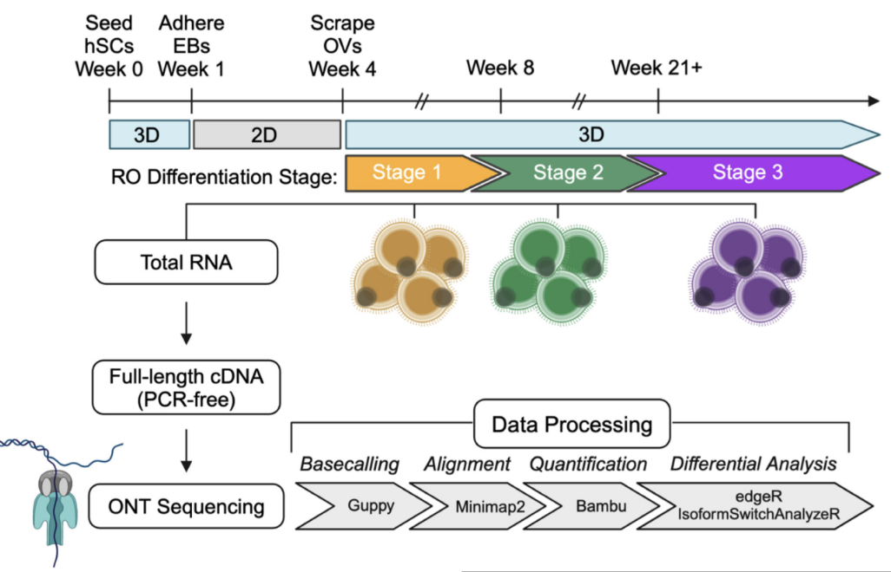

# Dynamic changes in mRNA isoform usage during human retinal development

## Overview

A preprint describing the data analysis is at [bioRxiv]().

## Study design

Organoids were differentiated from hSCs aggregated into 3D embryoid bodies (EBs) over the course of the first week of cell culture, followed by a three-week adherent phase and subsequent scraping of the emerged optic vesicles (OVs) for continued differentiation as free-floating ROs. Total RNA was extracted from pooled sets of organoids at three stages of differentiation (Stages 1-3) for cDNA synthesis and direct ONT sequencing of the full-length cDNA libraries. Basecalling of ONT reads was performed with Guppy, followed by alignment with minimap2. Genes and isoforms were quantified using Bambu for subsequent differential expression and usage analysis, as well as visualization.

## Data access

Raw and processed data are available in GenBank with BioProject PRJNA1171814.

Processed data objects are available in OSF: <https://doi.org/10.17605/OSF.IO/Z2YVS>

Data R package coming soon on Bioconductor: <https://github.com/sparthib/HumanRetinaLRSData>

## Contact

-   Casey J. Keuthan
-   Sowmya Parthiban
-   Stephanie Hicks
-   Donald J. Zack

## Internal

`/dcs04/hicks/data/sparthib/retina_lrs`

### Contents

-   `code`: scripts for data processing and visualization.
-   `plots`: Plots for upstream processing (pre quantification).
-   `processed_data`: Plots and data for post quantification and ASE analysis.
-   `raw_data`: data config and external resources.
